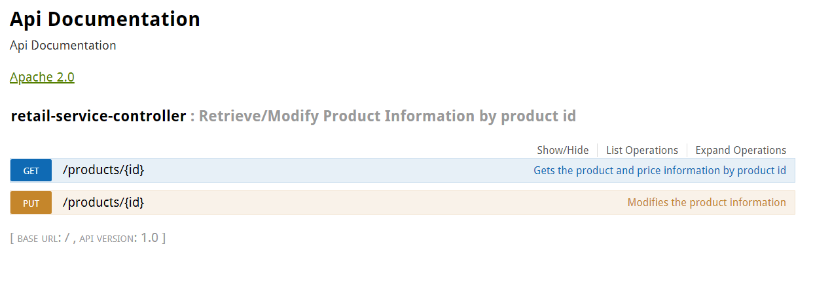

# Retail Service
## RetailService provides ability to retrieve product and update Price information in the local Datastore.

## Technologies used

#### Spring Boot
#### MongoDB-NoSql
#### Gradle
#### Swagger

## Installation Procedure

#### Download and install MongoDB - https://www.mongodb.com/
#### Start Mongodb database from commandline e.g. C:/Program Files/MongoDB/mongod
#### Clone or download the solution from https://github.com/asankaran78/retailService
#### Navigate to local retailService sourcecode folder from command prompt
#### run gradlew bootRun command and application would start.

## Verify Installation

#### After completing previous step open browser
#### Navigate to localhost:9000/swagger-ui.html
#### Swagger screen with API documentation would appear as shown below.

## Rest API

###Get /Products/{id}

#### The requests calls with valid product id, first calls external redsky API for product details and then queries local mongoDB datastore for price information.

#### Happy Path
#### Sample input {id} - 13860428 and response 

#### Output 
            {
              "productId": "13860428",
              "name": "The Big Lebowski (Blu-ray)",
              "currentPrice": {
                "value": "13.49",
                "currency_code": "USD"
              }
            }

#### Invalid input - Id not in external API
#### Sample input {id} - 15117729
#### Output with validations
        {
          "timestamp": "2018-06-24T15:18:46.744+0000",
          "status": 404,
          "error": "Not Found",
          "message": "Couldn't get Product details from external service",
          "path": "/products/15117729"
        }
        
#### Invalid input - Price info not in local repository for ProductId
#### Sample input {id} - 16696652
#### Output with validations
        {
          "timestamp": "2018-06-24T15:27:06.825+0000",
          "status": 404,
          "error": "Not Found",
          "message": "Couldn't get Product details from DataStore",
          "path": "/products/16696652"
        }
        
### Put /Products/{id}
#### The request call updates price info for ProductId in the local datastore
#### Sample input - happy path Products/1386048

    {
	"currentPrice": {
		"value": "15.49",
		"currency_code": "USD"
	},
	"name": "The Big Lebowski (Blu-ray) (Widescreen)",
	"productId": "13860428"
    }
    
#### Output - Response 200
 
    {
    "response": "success"
    }
    
#### Sample input - with invalid ProductId in local datastore
#### Products/138604
    {
  	"currentPrice": {
  		"value": "15.49",
  		"currency_code": "USD"
  	},
  	"name": "The Big Lebowski (Blu-ray) (Widescreen)",
  	"productId": "138604"
    } 
    
#### Output - 404 Not Found
    {
    "timestamp": "2018-06-24T15:46:14.598+0000",
    "status": 404,
    "error": "Not Found",
    "message": "ProductId doesn't exist in the DataStore",
    "path": "/products/138604"
    }  

